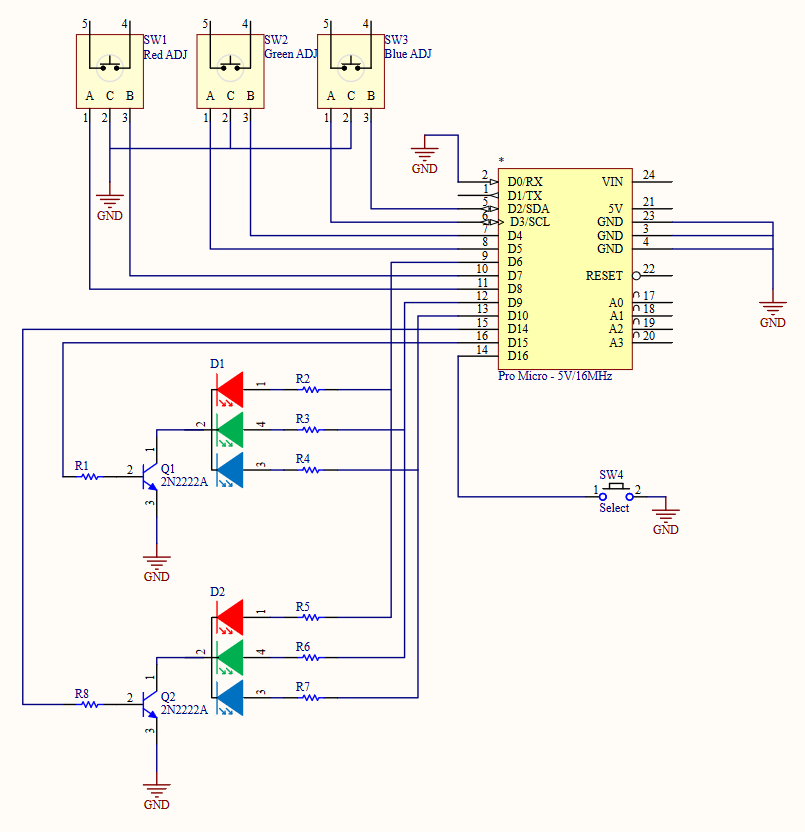

# Arduino RGB Multiplexed
Some quick and dirty proof of concept code for multiplexing RGB LEDs.

# Basic Premise
Each LED is driven by the NPN that connects the common cathode of the RGB. I've tried it with 2 LEDs. There are 3 2-bit grey code rotary encoders that are adjusting the PWM and a button to select what bank we are tuning.

# Findings
Lots of flicker but at the current settings it is acceptable in a pinch.

# Schematic

